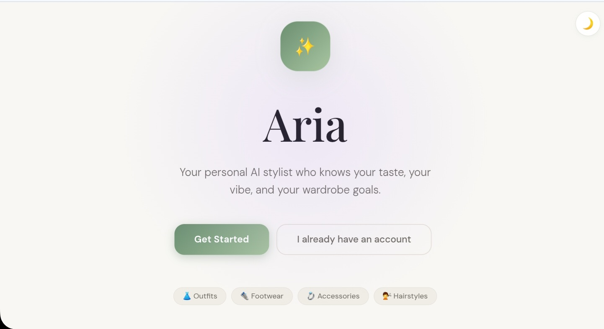
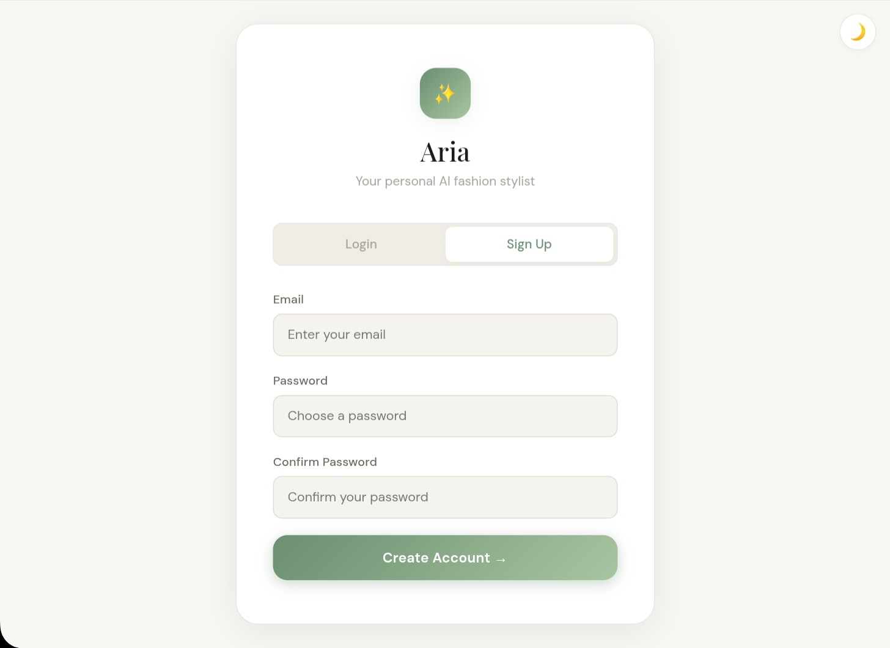
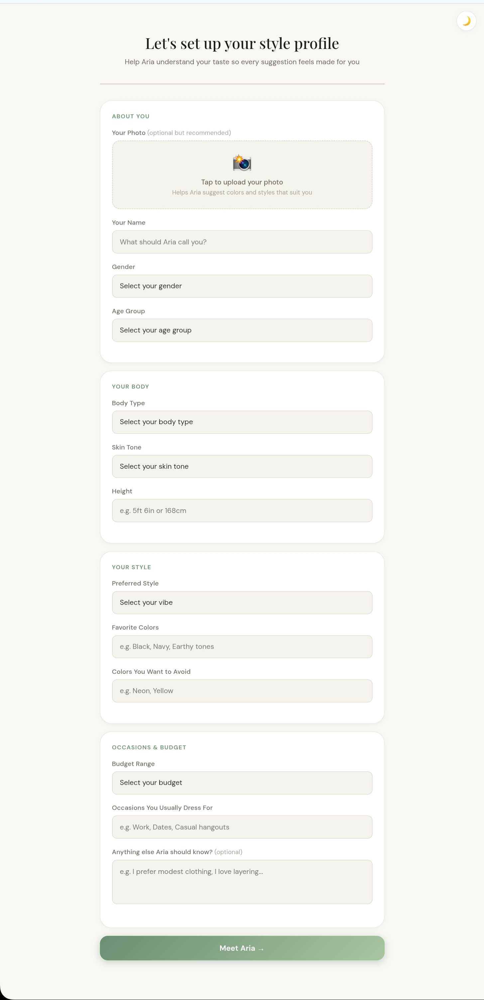
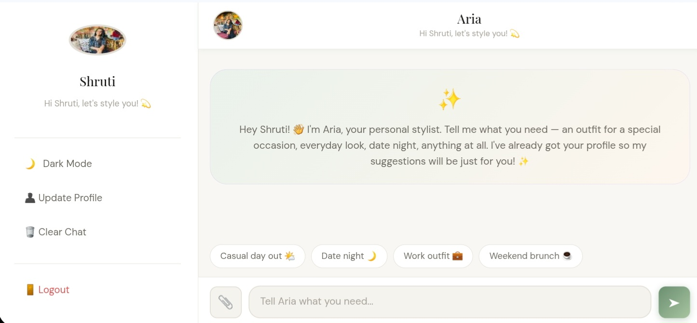
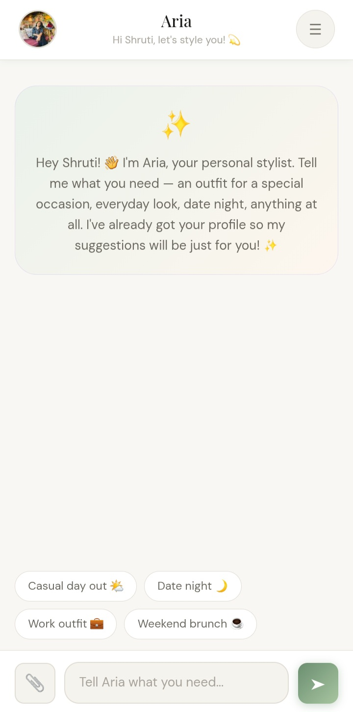
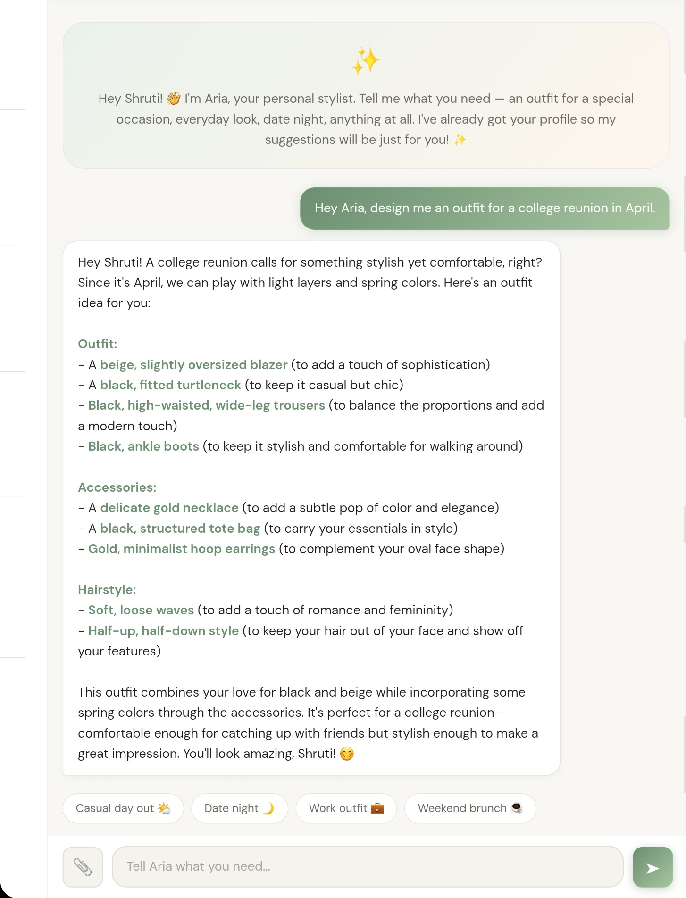
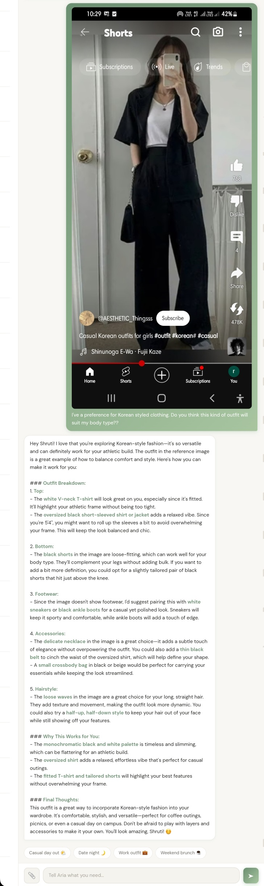
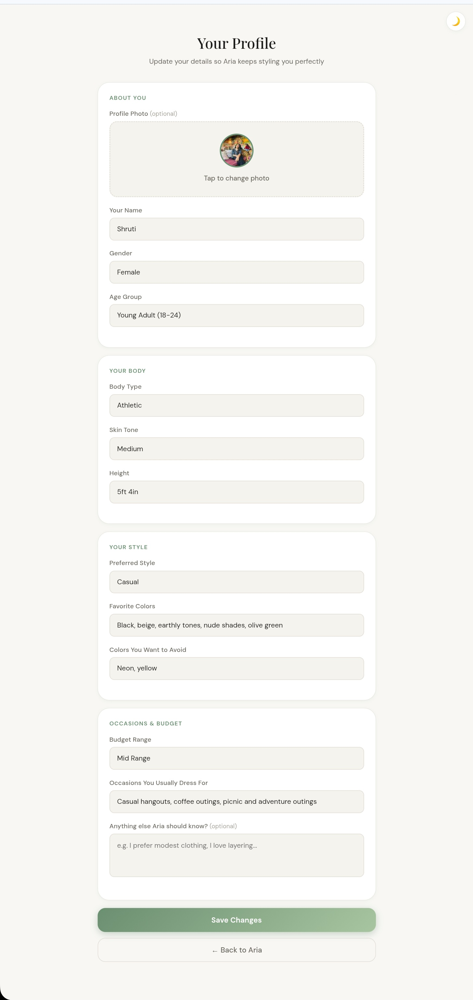

# Aria — User Guide

Aria is your personal AI-powered fashion stylist. Want an outfit for a date, for work, or for a weekend hangout? Tell Aria, and she will offer you tailored recommendations based on your style, body type, skin tone, budget, and wardrobe goals.

This user guide will take you through all you need to get started with Aria and make the most of your experience with her.

---

## Table of Contents

1. [Getting Started](#getting-started)
2. [Creating Your Account](#creating-your-account)
3. [Setting Up Your Style Profile](#setting-up-your-style-profile)
4. [Using the Chat](#using-the-chat)
5. [Sharing Reference Images](#sharing-reference-images)
6. [Managing Your Profile](#managing-your-profile)
7. [Tips for Better Suggestions](#tips-for-better-suggestions)
8. [Frequently Asked Questions](#frequently-asked-questions)

---

## Getting Started

Aria works right inside your web browser, so you don't need to download anything. You can use it on your phone, tablet, or computer.

**To open Aria:**

1. Go to [aria-fashion-stylist-production.up.railway.app](https://aria-fashion-stylist-production.up.railway.app) in your browser
2. Click **Get Started** to create a new account, or **I already have an account** if you have logged in before

---

## Creating Your Account

Aria requires a free account to personalize your experience. Your profile is saved securely so your preferences are always there every time you return.

**To create an account:**

1. Click **Get Started** on the landing page
2. You will now be redirected to the login page — click the **Sign Up** tab
3. Enter your email address and choose a password (minimum 6 characters)
4. Confirm your password and click **Create Account**

You will be automatically signed in and taken to your style profile setup.

> **Note:** Aria uses your email only for login. It is never shared or used for marketing.

---

## Setting Up Your Style Profile

Your style profile is what makes Aria personal. The more detail you provide pf yourself and your preferences, the better her suggestions will be. You only need to do this once.

### About You

| Field | What to enter |
|-------|--------------|
| **Your Photo** | Optional but recommended. Aria uses it to understand your skin tone, hair color, and features for more accurate color and style suggestions. |
| **Your Name** | What Aria will call you in conversation. |
| **Gender** | Used to tailor clothing suggestions. |
| **Age Group** | Helps Aria suggest age-appropriate styles. |

### Your Body

| Field | What to enter |
|-------|--------------|
| **Body Type** | Choose the option that feels closest to you. |
| **Skin Tone** | Used to suggest colors that complement your complexion. |
| **Height** | Enter in any format, for example 5ft 4in or 163cm. |

### Your Style

| Field | What to enter |
|-------|--------------|
| **Preferred Style** | Your everyday vibe — casual, streetwear, formal, minimalist, and so on. |
| **Favorite Colors** | Colors you love and want to wear more of. |
| **Colors to Avoid** | Colors you dislike or never want suggested. |

### Occasions and Budget

| Field | What to enter |
|-------|--------------|
| **Budget Range** | Aria will suggest items that realistically fit your budget. |
| **Occasions** | The situations you typically dress for, for example work, dates, casual hangouts. |
| **Additional Notes** | Anything else Aria should know, for example I prefer modest clothing or I love layering. |

Once you have filled in your details, click **Meet Aria** to save your profile and open the chat.

---

## Using the Chat

The chat is where the magic happens. Just talk to Aria like you would a friend who happens to be a stylist.

### What you can ask

Aria can help with a wide range of styling requests. Here are some examples:

**Outfit requests**
- "What should I wear for a casual day out?"
- "Give me a date night outfit"
- "I have a job interview next week, what should I wear?"

**Wardrobe advice**
- "Help me build a capsule wardrobe"
- "What are the key pieces I should invest in?"
- "How do I dress for my body type?"

**Color and styling guidance**
- "What colors work best for my skin tone?"
- "How do I style wide-leg trousers?"
- "What accessories go with a minimalist outfit?"

**Seasonal and occasion dressing**
- "What should I wear in winter without looking bulky?"
- "Give me a festival outfit"
- "I have a beach wedding to attend"

### Sending a message

1. Type your question or request in the text box at the bottom of the screen
2. Press **Enter** or tap the send button
3. Aria will respond within a few seconds

You can also use the **quick suggestion chips** at the bottom of the screen for common requests like Casual day out, Date night, Work outfit, and Weekend brunch.

### Conversation memory

Aria remembers your conversation within the same session and across sessions. You can refer back to previous messages and build on them, for example:

- "I like the first outfit you suggested, what shoes would go with it?"
- "Can you suggest something similar but more formal?"

---

## Sharing Reference Images

You can share images with Aria during a conversation. This is useful when you want to refer to a style you like, an outfit you already own, or a look you want to recreate.

**To share an image:**

1. Tap the **📎 paperclip** button next to the text box
2. Select an image from your phone or device
3. A preview chip will appear showing your selected image
4. Type your message or question alongside the image
5. Tap send

Aria will analyze the image and incorporate what she sees into her response. For example, if you share a photo of a jacket you own, she can suggest outfits built around it.

**What kinds of images work best:**
- Clothing items or full outfits
- Style inspiration photos
- Shoes or accessories you want to match
- Your own photos if you want feedback on a look

> **Note:** Images are analyzed privately and are not stored permanently.

---

## Managing Your Profile

You can update your style profile at any time. This is useful if your style changes, you move to a new city with a different climate, or your budget changes.

**To update your profile:**

1. Open the menu by tapping **☰** in the top right corner of the chat
2. Tap **👤 Update Profile**
3. Make your changes
4. Tap **Save Changes**

Your updated profile takes effect immediately — Aria will use your new preferences in the very next message.

### Updating your profile photo

To change your profile photo, tap the photo area at the top of the profile page and select a new image. Aria will re-analyze your appearance and update her understanding of your features.

---

## Tips for Better Suggestions

Getting the most out of Aria is all about how you talk to her. Here are some tips:

**Be specific about the occasion**
Instead of "what should I wear?", try "what should I wear to an outdoor birthday party in October?". The more context you give, the more useful the suggestion.

**Tell her what you already own**
"I have a white linen shirt and beige trousers — what can I pair with them?" helps Aria give practical advice rather than starting from scratch every time.

**Share reference images**
If you have a look in mind, show her. A picture is worth a thousand words, even for an AI stylist.

**Give feedback**
If you don't like a suggestion, just say so. "I don't like that, can you suggest something less formal?" or "I love this, give me more options like it" helps Aria refine her recommendations.

**Fill in your profile completely**
The additional notes field is especially valuable. Details like "I run warm so I avoid heavy fabrics" or "I cycle to work so I need practical outfits" make a real difference to the quality of suggestions.

---

## Frequently Asked Questions

**Is Aria free to use?**
Yes, Aria is completely free.

**Do I need to create an account?**
Yes. An account is required so Aria can save your style profile and conversation history across sessions.

**Is my data private?**
Your profile and conversations are stored securely and are only used to personalize your Aria experience. They are not shared with third parties.

**Can I use Aria on my phone?**
Yes. Aria is fully responsive and works on any device including phones, tablets, and desktops.

**Why did Aria not analyze my profile photo?**
Photo analysis uses an AI vision model that can occasionally time out. If this happens, your profile is still saved without the photo analysis. You can try uploading the photo again from the profile edit page.

**How do I start a fresh conversation?**
Open the menu by tapping **☰** and select **🗑️ Clear Chat**. This removes your conversation history and starts fresh. Your style profile is not affected.

**How do I log out?**
Open the menu by tapping **☰** and select **🚪 Logout**.

**Can I change my email or password?**
Not currently. Email and password changes are not supported in this version.

---

*Having trouble? Make sure you have a stable internet connection and try refreshing the page. If the issue persists, try logging out and back in.*

---

## Contact

Have feedback, questions, or just want to say hi?

- **Email:** rajpurohitshruti20@gmail.com
- **GitHub:** [Shruti-Rajpurohit](https://github.com/Shruti-Rajpurohit)
- **LinkedIn:** [Shruti Rajpurohit](https://www.linkedin.com/in/shruti-rajpurohit-976b44226)
